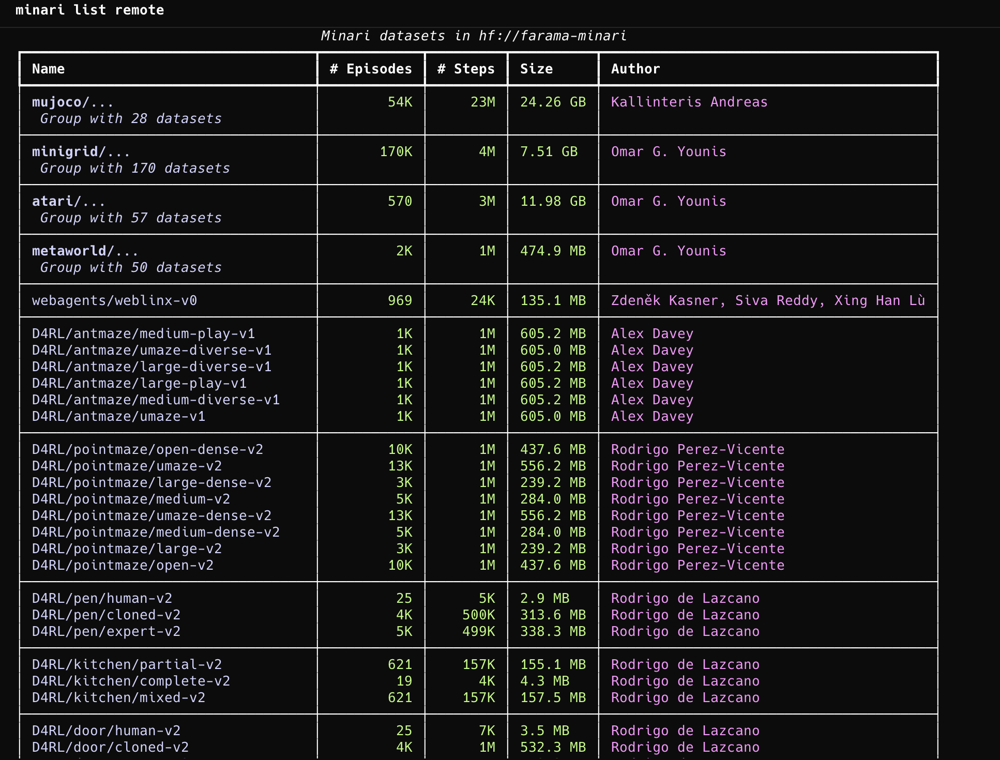

# 09 - Offline RL with Minari + d3rlpy (CQL/IQL)

## A dataset API for Offline Reinforcement Learning
Minari is a Python API that hosts a collection of popular Offline Reinforcement Learning datasets.

## Difficulty
Advanced

## Goal
Train high-performing policies from static datasets without online interaction and compare offline RL algorithms.

## Environment and Algorithms
- Datasets: Minari datasets (Gymnasium-compatible trajectories)
- Algorithms: CQL, IQL (d3rlpy)
- Libraries: Minari, d3rlpy, Gymnasium, (optional) RLlib Offline API

## What You Will Learn
- Dataset quality and distribution shift in offline RL
- Conservative Q-learning and implicit value regularization
- Offline evaluation pitfalls (OPE vs online rollouts)

## Implementation Milestones
1. Load and inspect a Minari dataset.
2. Train BC baseline from the same dataset.
3. Train CQL and IQL with comparable compute budgets.
4. Evaluate policies in the original Gymnasium environment.
5. Analyze sensitivity to dataset coverage and noise.

## Success Criteria
- CQL/IQL outperform BC baseline on return.
- Report includes failure modes and dataset diagnostics.

## Stretch Ideas
- Compare medium vs expert datasets.
- Add OPE estimators (e.g., FQE) and compare with rollout scores.

## Helper Docs and Blogs
- [Minari Documentation](https://minari.farama.org/)
- [Minari Basic Usage](https://minari.farama.org/content/basic_usage/)
- [d3rlpy Documentation](https://d3rlpy.readthedocs.io/)
- [d3rlpy Algorithms Reference](https://d3rlpy.readthedocs.io/en/v2.8.1/references/algos.html)
- [d3rlpy Tutorials](https://d3rlpy.readthedocs.io/en/v2.8.1/tutorials/index.html)
- [CQL Paper](https://arxiv.org/abs/2006.04779)
- [IQL Paper](https://arxiv.org/abs/2110.06169)
- [D4RL Benchmark Paper](https://arxiv.org/abs/2004.07219)
